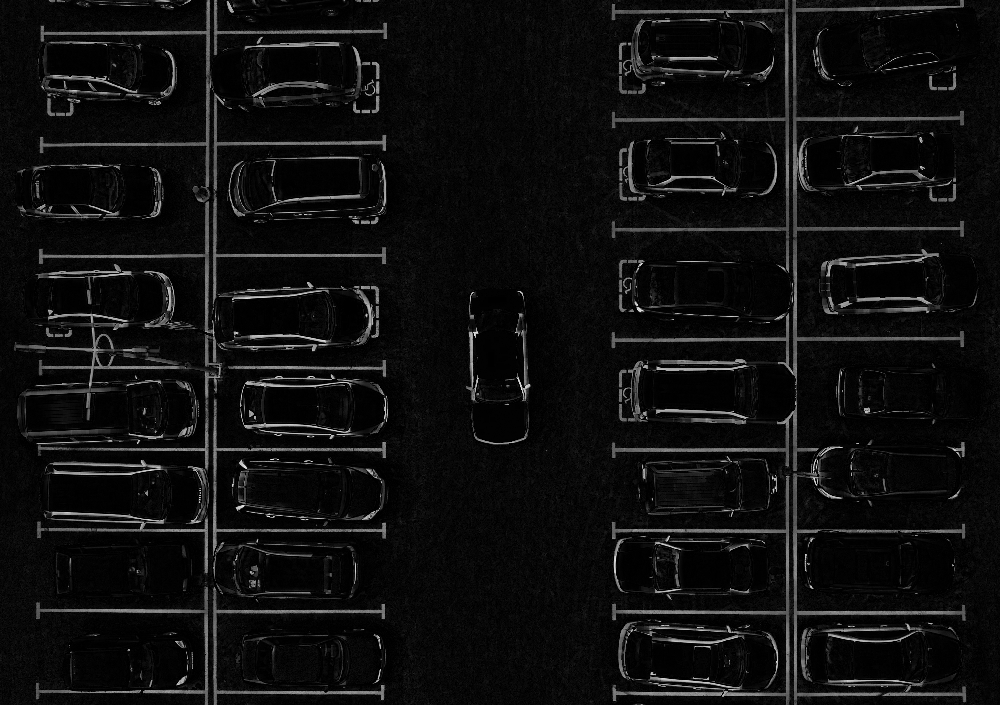
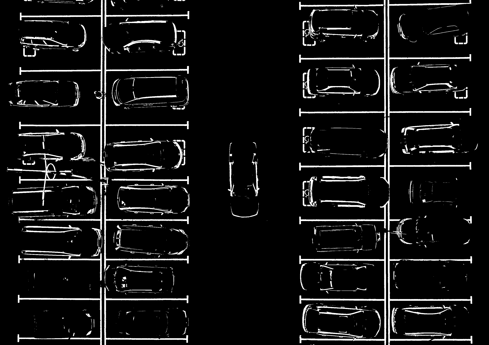
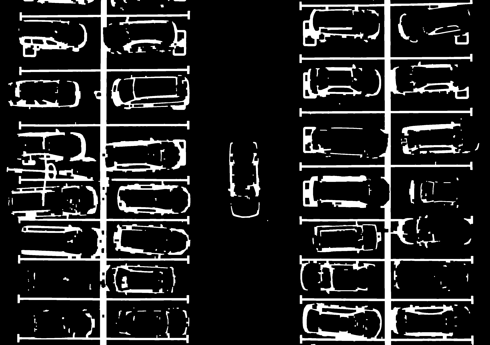

# Mini Project 2 [Object Counting]

**Mata Kuliah:** Pengolahan Citra dan Video  
* **Nama :** Lu'bah Al 'Aini
* **NRP :** 5024241082

---

## 1. Identitas Proyek
* **Target Objek:** Mobil pada foto aerial area parkir
* **Jumlah Mobil Terdeteksi:** **27 Mobil**
* **Library Utama:** OpenCV (cv2), NumPy, Matplotlib

---

## 2. Penjelasan Pipeline
Strategi yang digunakan adalah memisahkan objek berdasarkan perbedaan intensitas cahaya dan bentuk geometris melalui langkah-langkah berikut:

1.  **Konversi Ruang Warna (HSV - Value Channel):** Citra dikonversi ke ruang warna HSV, dan diambil channel **Value (V)**. Alasan: Channel ini menonjolkan kecerahan objek sehingga mobil (terang/mengkilap) lebih mudah dipisahkan dari aspal (gelap/matte) dibandingkan menggunakan grayscale biasa.
2.  **Top-Hat Transform:** Menerapkan operasi morfologi *Top-Hat* untuk mengekstrak objek terang yang berukuran kecil/sedang dan meratakan pencahayaan latar belakang yang tidak konsisten.
3.  **Thresholding (Otsu's Method):** Melakukan binarisasi otomatis untuk mengubah citra menjadi hitam (background) dan putih (objek).
4.  **Morfologi Agresif (Closing):** Menggunakan operasi *Closing* dengan iterasi tinggi (4x-5x) untuk "mengelem" bagian-bagian mobil yang terpisah (seperti kap mesin dan bagasi yang terpisah oleh kaca gelap) menjadi satu blok objek solid.
5.  **Geometric Filtering:** Kontur yang ditemukan difilter berdasarkan:
    * **Area:** Menghapus noise kecil (marka jalan) dan objek yang terlalu besar.
    * **Aspect Ratio:** Memastikan objek berbentuk persegi panjang (rasio 0.5 - 2.2) sesuai bentuk fisik mobil dari tampak atas.

---

## 3. Visualisasi Tahapan
Berikut adalah progres pengolahan citra dari awal hingga deteksi akhir:

| Tahap | Gambar | Deskripsi |
| :--- | :---: | :--- |
| **Step 1** |  | Hasil Top-Hat Transform (Menonjolkan mobil). |
| **Step 2** |  | Hasil Binarisasi (Pemisahan awal objek). |
| **Step 3** |  | Hasil Morfologi (Objek menyatu menjadi kotak). |
| **Final** |  | Hasil Akhir dengan Bounding Box (27 Mobil). |

---

## 4. Analisis
* **Akurasi:** Program berhasil mendeteksi **27 mobil**. Terdapat beberapa mobil yang tidak terhitung karena kontras warna yang terlalu rendah dengan aspal atau terhalang bayangan pohon yang pekat.
* **Kendala:** Marka jalan putih seringkali memiliki nilai intensitas yang sama dengan mobil putih. Hal ini diatasi dengan filter *Aspect Ratio* yang ketat.
* **Peningkatan:** Untuk mencapai akurasi lebih tinggi (29), bisa ditambahkan algoritma *Watershed* untuk memisahkan dua mobil yang terdeteksi menempel menjadi satu kontur.

---

## 5. Cara Menjalankan Program
1.  Pastikan library tersedia:  
    `pip install opencv-python numpy matplotlib`
2.  Siapkan struktur folder sebagai berikut:
    ```
    /project-folder
    ├── counting.py
    ├── input/
    │   └── parking.jpg
    └── output/
    ```
3.  Jalankan program melalui terminal:  
    `python counting.py`
4.  Cek hasil akhir di `output/result.png`
